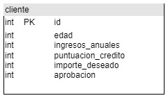
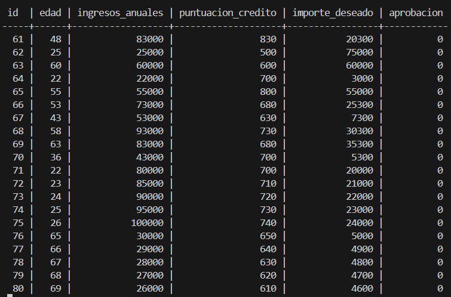
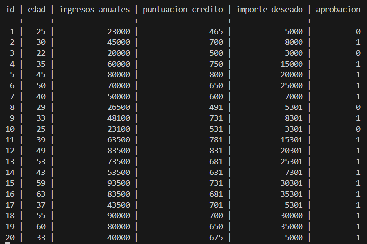
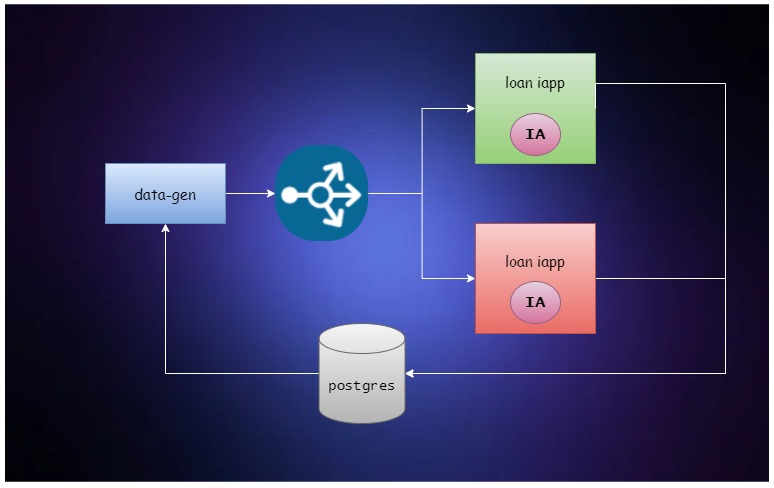

# Sistema de Aprobación de Préstamos con IA 🤖💰

<p align="center" style="margin-bottom: 0px !important;">
  
</p>

¿Cansado de procesos de aprobación de préstamos lentos y tediosos? ¡Tenemos la solución! Nuestro sistema de vanguardia utiliza el poder de la inteligencia artificial (IA) para transformar la forma en que se evalúan las solicitudes de préstamos.

## ¿Qué Hacemos? 🤔

Nuestro sistema inteligente analiza minuciosamente los datos de los solicitantes, como:

*   Edad
*   Ingresos
*   Historial crediticio
*   Monto solicitado

Luego, nuestro modelo de IA, un Perceptron altamente entrenado, predice con precisión si un préstamo tiene probabilidades de ser reembolsado. ¡Adiós a las conjeturas y a las largas esperas!

## ¿Por Qué Elegirnos? 😎

*   🚀 **Decisiones Más Rápidas:** Nuestra IA toma decisiones en segundos, acelerando el proceso de aprobación.
*   🎯 **Mayor Precisión:** Nuestro modelo se basa en datos y algoritmos avanzados para minimizar los errores.
*   ⚙️ **Escalabilidad:** Nuestra arquitectura de microservicios, con Docker y Kubernetes, se adapta a tus necesidades.
*   🛠️ **Fácil Implementación:** Implementa nuestro sistema en tu infraestructura existente sin complicaciones.

### ¡El Futuro de los Préstamos Está Aquí! ✨

Únete a la revolución de la IA en la industria financiera. ¡Descubre cómo nuestro sistema puede optimizar tus operaciones y mejorar la satisfacción de tus clientes!

## Características Destacadas

*   **Modelo de IA Robusto:** Nuestro modelo de aprendizaje automático, basado en un Perceptron, ha sido entrenado con datos históricos de préstamos, lo que garantiza predicciones confiables.
*   **Arquitectura de Microservicios:** El sistema está diseñado con microservicios (generador de datos, balanceador de carga y aplicación de IA) para una mayor escalabilidad y mantenimiento.
*   **Contenerización con Docker:** Cada microservicio se ejecuta en un contenedor Docker, lo que facilita la implementación y la portabilidad en diferentes entornos.
*   **Orquestación con Kubernetes (Opcional):** Para entornos de producción, puedes utilizar Kubernetes para gestionar y escalar automáticamente los microservicios.

# ¿Cómo Funciona?

1.  **Generación de Datos:** El componente `gen` extrae datos de clientes relevantes (edad, ingresos, puntuación crediticia, etc.) de una base de datos PostgreSQL.
2.  **Balanceo de Carga:** El `loadbalancer`, implementado con Nginx, distribuye los datos de los clientes entre varias instancias de la aplicación de IA para un procesamiento eficiente.
3.  **Predicción de Aprobación:** Las instancias de la aplicación `iapp` utilizan el modelo de IA para evaluar los datos y predecir si se debe aprobar o rechazar el préstamo.
4.  **Actualización de la Base de Datos:** Los resultados de las predicciones se almacenan en la base de datos, lo que permite un seguimiento y análisis posterior.

<p align="center" style="margin-bottom: 0px !important;">
  
</p>

<p align="center" style="margin-bottom: 0px !important;">
  
</p>

<p align="center" style="margin-bottom: 0px !important;">
  
</p>

## Arquitectura del Sistema

<p align="center" style="margin-bottom: 0px !important;">
  
</p>

Nuestro sistema está diseñado como una arquitectura de microservicios, donde cada componente cumple una función específica y se comunica con los demás a través de una red. Esta estructura ofrece modularidad, escalabilidad y facilidad de mantenimiento.
### Componentes Principales 

1. **Base de Datos (PostgreSQL):**
Almacena los datos de los clientes, incluyendo información personal, financiera y el estado de aprobación de sus préstamos.
Utiliza el sistema de gestión de bases de datos relacionales PostgreSQL para garantizar la integridad y consistencia de los datos.
Se comunica con los demás componentes a través de la biblioteca psycopg2 de Python.

2. **Generador de Datos (gen):**
Consulta la base de datos para extraer los datos de los clientes que aún no han sido evaluados.
Envía estos datos al balanceador de carga en formato JSON a través de solicitudes HTTP.
Está implementado con Flask, un framework web ligero de Python.

3. **Balanceador de Carga (loadbalancer):**
Distribuye equitativamente las solicitudes de evaluación de préstamos entre las instancias disponibles de la aplicación de IA (iapp).
Utiliza Nginx, un servidor web de alto rendimiento, para gestionar el tráfico de manera eficiente.
Asegura que ninguna instancia de la aplicación de IA se sobrecargue, mejorando la capacidad de respuesta del sistema.

4. **Aplicación de IA (iapp):**
Recibe los datos de los clientes del balanceador de carga.
Utiliza un modelo de aprendizaje automático (Perceptron) entrenado para predecir si el cliente es apto para recibir un préstamo.
Actualiza la base de datos con el resultado de la predicción (aprobado o rechazado).
Está implementado con Flask y utiliza la biblioteca LoanBot.py para cargar y ejecutar el modelo de IA.

5. **Flujo de Trabajo:**
El Generador de Datos consulta la base de datos y obtiene los datos de un cliente.
Los datos se envían al Balanceador de Carga.
El Balanceador de Carga elige una instancia de la Aplicación de IA y le envía los datos.
La Aplicación de IA procesa los datos, realiza la predicción y actualiza la base de datos.

6. **Escalabilidad y Tolerancia a Fallos:**
La arquitectura de microservicios permite escalar horizontalmente cada componente de forma independiente según la demanda.
El balanceador de carga distribuye el tráfico, lo que aumenta la disponibilidad y la tolerancia a fallos del sistema.
### Tecnologías Utilizadas:
Lenguajes: Python
Frameworks: Flask
Bibliotecas: psycopg2, NumPy
Base de Datos: PostgreSQL
Servidor Web: Nginx
Contenedores: Docker
Orquestación (Opcional): Kubernetes
## Instrucciones de Implementación (Minikube)

1.  **Clona este repositorio:**
    ```bash
    git clone [https://github.com/](https://github.com/)<tu_usuario>/<tu_repositorio>.git
    ```

2.  **Inicia Minikube:**
    ```bash
    minikube start
    ```
    

3.  **Despliega los componentes:**
    ```bash
    kubectl apply -f kubernetes/postgresql-pvc.yaml
    kubectl apply -f kubernetes/postgresql-deployment.yaml
    kubectl apply -f kubernetes/postgresql-service.yaml
    kubectl apply -f kubernetes/loadbalancer-service.yaml
    kubectl apply -f kubernetes/gen-deployment.yaml
    kubectl apply -f kubernetes/gen-service.yaml
    kubectl apply -f kubernetes/iapp-deployment.yaml
    kubectl apply -f kubernetes/iapp-service.yaml
    ```

4.  **Accede a la aplicación:** Encuentra la IP del servicio y el puerto en los que se expone la aplicación.

    
    
    
    
## Próximos Pasos

*   **Integración con Istio:** Mejorará la gestión del tráfico, la seguridad y la observabilidad con Istio.
*   **Monitorización:** Se añadirán herramientas de monitorización para supervisar el rendimiento y la salud del sistema.
*   **Optimización del Modelo:** Se experimentará con diferentes algoritmos y técnicas de ajuste para mejorar la precisión del modelo de IA.

## Contribuciones

¡Las contribuciones son bienvenidas! Si tienes ideas para mejorar el proyecto, abre un issue o envía un pull request.
